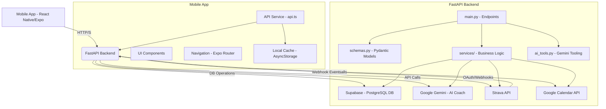

## Architectural Review: Chimera Mobile App and API

This review focuses on the overall system architecture, mobile app and API interaction, scalability concerns, performance bottlenecks, and technology choices.

### 1. System Overview

The Chimera project consists of two main components:
- **Chimera API**: A FastAPI application (`chimera_api/`) serving as the backend, handling workout management, daily logs, Strava integration, and AI chat functionality via Google Gemini. It uses Supabase for database interactions and Google Calendar for event synchronization.
- **Chimera Mobile App**: A React Native/Expo application (`chimera_mobile_app/`) providing the user interface for viewing workouts, daily logs, and interacting with the AI coach. It communicates with the Chimera API.

### 2. Technology Choices Assessment

- **FastAPI (API)**:
    - **Suitability**: Excellent choice for building high-performance APIs with automatic data validation, serialization, and interactive documentation (Swagger UI). Its asynchronous nature (`async/await`) is well-suited for I/O-bound operations like database calls and external API integrations (Strava, Gemini).
    - **Scalability**: FastAPI itself is highly scalable. Performance will primarily depend on the underlying database (Supabase) and external services (Gemini, Strava).
- **React Native/Expo (Mobile App)**:
    - **Suitability**: Good choice for cross-platform mobile development, allowing a single codebase for iOS and Android. Expo simplifies development and deployment.
    - **Scalability**: React Native/Expo can handle complex UIs and data. Performance bottlenecks are more likely to arise from inefficient data fetching, large data sets, or complex UI rendering rather than the framework itself.

### 3. API Structure, Endpoints, and Data Models

- **Structure**: The API is well-organized with `main.py` for routing, `schemas.py` for Pydantic models, and `services/` for business logic.
- **Endpoints**: Clear RESTful endpoints for workouts, daily logs, and Strava integration. The `/v1/chat` endpoint handles AI interactions.
- **Data Models**: Pydantic models in `schemas.py` provide robust data validation and serialization, which is a strong point for API reliability and maintainability.
- **External Integrations**:
    - **Google Gemini**: Integrated for AI chat. The `ai_tools.py` and `main.py` handle tool calling and response processing.
    - **Supabase**: Used as the primary database. `db_client.py` manages the connection.
    - **Strava**: Webhook and OAuth flow are implemented for activity synchronization.
    - **Google Calendar**: `gcal_service.py` handles syncing workouts to Google Calendar.

### 4. Mobile App Data Flow and API Interactions

- **Data Fetching**: The `api.ts` service handles all API calls from the mobile app. It includes a basic caching mechanism using `AsyncStorage` for workouts, which is good for initial load times.
- **State Management**: React's `useState` and `useCallback`/`useEffect` hooks are used for local component state. There doesn't appear to be a global state management solution (e.g., Redux, Zustand, React Context API for larger state) which might become a concern for more complex data sharing across many components.
- **Navigation**: `expo-router` is used for navigation, providing a file-system based routing approach.
- **UI Components**: Standard React Native components and some custom `themed-` components are used. `react-native-gifted-chat` is used for the chat interface.

### 5. Scalability and Performance Bottlenecks

#### API Bottlenecks:

1.  **Supabase Interactions**:
    *   **Concern**: Direct `supabase_admin` calls in service files (e.g., `daily_log_service.py`, `strava_service.py`, `workout_service.py`) are synchronous by default in the Supabase Python client. While FastAPI handles `async` endpoints, the actual database calls might block the event loop if not properly awaited or run in a thread pool. The current implementation uses `await` with `execute()`, which implies the Supabase client is configured for async operations or the `execute()` method itself is non-blocking. This needs verification.
    *   **Potential Bottleneck**: High concurrent database writes/reads could strain Supabase or block the FastAPI event loop if not truly asynchronous.
2.  **External API Calls (Strava, Gemini)**:
    *   **Concern**: Calls to Strava and Gemini are external network requests. `strava_service.py` uses `requests.post` and `requests.get`, which are synchronous blocking calls. These will block the FastAPI event loop, impacting concurrency.
    *   **Potential Bottleneck**: Under heavy load, multiple concurrent Strava webhook events or chat requests could lead to significant latency and reduced API throughput.
3.  **Hardcoded User ID**:
    *   **Concern**: `HARDCODED_USER_ID` in `workout_service.py` and `daily_log_service.py` indicates a single-user system. This is a major scalability limitation for a multi-user application.
    *   **Potential Bottleneck**: Cannot scale to multiple users without a proper authentication and user management system.
4.  **Google Calendar Sync**:
    *   **Concern**: `_get_calendar_service()` and `sync_workout_to_calendar()` in `gcal_service.py` also perform external network requests.
    *   **Potential Bottleneck**: Similar to Strava/Gemini, these can introduce blocking I/O if not handled asynchronously.

#### Mobile App Bottlenecks:

1.  **Data Fetching Strategy**:
    *   **Concern**: The `useFocusEffect` in `calendar.tsx` fetches all workouts on screen focus. While caching is used, fetching *all* workouts every time the calendar screen is focused could become slow with a large number of historical workouts.
    *   **Potential Bottleneck**: Large data payloads for `getWorkouts` could lead to slow loading times and increased memory usage on the device.
2.  **UI Rendering**:
    *   **Concern**: Rendering long lists of workouts or daily logs without virtualization (e.g., `FlatList`, `SectionList`) could lead to performance issues on lower-end devices.
    *   **Potential Bottleneck**: Janky scrolling or slow UI response if many items are rendered simultaneously.
3.  **Chat Screen `BACKEND_URL`**:
    *   **Concern**: The `BACKEND_URL` in `chat.tsx` is hardcoded. This makes environment management (dev, staging, prod) difficult and error-prone.
    *   **Potential Bottleneck**: Deployment issues if the URL needs to change across environments.

### 6. Recommendations

#### API Recommendations:

1.  **Implement Asynchronous I/O for External Calls**:
    *   **Action**: Replace `requests` with an asynchronous HTTP client like `httpx` for all external API calls (Strava, Gemini, Google Calendar). This will ensure that network requests do not block the FastAPI event loop, significantly improving concurrency and throughput.
    *   **Example**:
        ```python
        # In strava_service.py or gcal_service.py
        import httpx
        # ...
        async with httpx.AsyncClient() as client:
            response = await client.get(url, headers=headers)
        ```
2.  **User Authentication and Authorization**:
    *   **Action**: Implement a robust authentication system (e.g., JWT with Supabase Auth) to replace `HARDCODED_USER_ID`. This is critical for any multi-user application.
    *   **Impact**: Enables personalized data, security, and proper user segmentation.
3.  **Database Query Optimization**:
    *   **Action**: Review Supabase queries for potential N+1 issues or inefficient filters. Ensure appropriate indexing on `user_id`, `date`, `start_time`, and `source_id` columns.
    *   **Impact**: Improves database response times, especially as data volume grows.
4.  **Background Tasks for Long-Running Operations**:
    *   **Action**: For operations like Strava webhook processing or Google Calendar syncing, consider offloading them to background tasks (e.g., using Celery with Redis, or FastAPI's `BackgroundTasks`). This allows the API to respond immediately to the client while processing continues asynchronously.
    *   **Impact**: Improves API responsiveness and user experience, prevents timeouts for long-running tasks.

#### Mobile App Recommendations:

1.  **Paginating or Filtering Data Fetching**:
    *   **Action**: Implement pagination or date-range filtering for `getWorkouts` in `api.ts` and `calendar.tsx`. Instead of fetching all workouts, fetch only those relevant to the current view (e.g., current month, next 30 days).
    *   **Impact**: Reduces data transfer, improves loading times, and lowers memory footprint.
2.  **Optimize List Rendering**:
    *   **Action**: For lists like workouts in `calendar.tsx`, use `FlatList` or `SectionList` components from React Native, which are optimized for rendering large data sets by virtualizing items.
    *   **Impact**: Smoother scrolling and better performance, especially on devices with limited resources.
3.  **Environment Configuration for API_BASE**:
    *   **Action**: Externalize the `API_BASE` URL in `chimera_mobile_app/services/api.ts` and `chat.tsx` using Expo's `extra` field in `app.json` or environment variables.
    *   **Example (app.json)**:
        ```json
        "extra": {
          "apiUrl": "https://trainer-2-0.onrender.com/v1"
        }
        ```
        Then access via `Expo.Constants.manifest.extra.apiUrl`.
    *   **Impact**: Easier deployment to different environments (development, staging, production) without code changes.
4.  **Global State Management (Optional, for growth)**:
    *   **Action**: As the app grows, consider introducing a global state management library (e.g., Zustand, React Context API with `useReducer`) to manage shared data like user settings, authentication status, or frequently accessed workout data.
    *   **Impact**: Centralizes state, simplifies data flow, and reduces prop drilling.

### Mermaid Diagram: High-Level System Architecture



This architectural review provides a foundation for future development, focusing on enhancing scalability, performance, and maintainability.